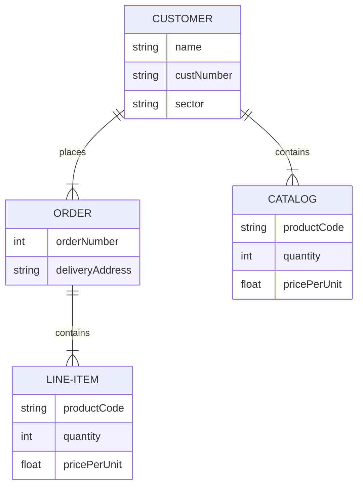

# SUMMARY

```mermaid
erDiagram
    CUSTOMER ||--|{ ORDER : places
    CUSTOMER {
        string name
        string custNumber
        string sector
    }
    ORDER ||--|{ LINE-ITEM : contains
    ORDER {
        int orderNumber
        string deliveryAddress
    }
    LINE-ITEM {
        string productCode
        int quantity
        float pricePerUnit
    }
    CUSTOMER ||--|{ CATALOG : contains
    CATALOG {
        string productCode
        int quantity
        float pricePerUnit
    }
```
