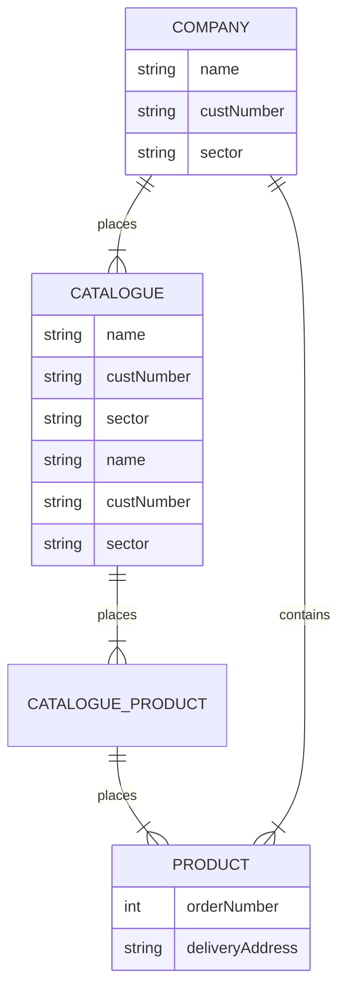

# SUMMARY

```mermaid
erDiagram
    COMPANY ||--|{ CATALOGUE : places
    COMPANY {
        string name
        string custNumber
        string sector
    }
    CATALOGUE ||--|{ CATALOGUE_PRODUCT : places
    CATALOGUE {
        string name
        string custNumber
        string sector
    }
    CATALOGUE_PRODUCT ||--|{ PRODUCT : places
    CATALOGUE {
        string name
        string custNumber
        string sector
    }
    COMPANY ||--|{ PRODUCT : contains
    PRODUCT {
        int orderNumber
        string deliveryAddress
    
    }
```
